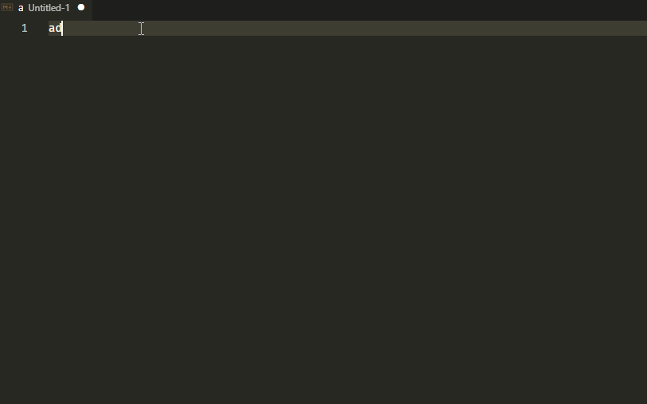

# adr-snippets README

 This extension contains snippets for Architecture Decision Records(ADR).
 Helps to create ADR basic document, after that we can edit title or any other part of the document.

 We will use Architecture Decision Records, as [described by Michael Nygard](http://thinkrelevance.com/blog/2011/11/15/documenting-architecture-decisions).

 Supported languages (file extensions)

 * Markdown (.md)

## Usage

Type part of a snippet, press enter, and the snippet unfolds.

Alternatively, press Ctrl+Space (Windows, Linux) or Cmd+Space (macOS) to activate snippets from within the editor.

| Snippet                      |  Purpose                                                             |
| ---------------------------- | -------------------------------------------------------------------- |
| `adr`                        | Inserts basic ADR                                                    |
| `adr-status`                 | ADR status                                                           |

## Installation

1. Install Visual Studio Code 1.66.0 or higher
1. Launch Code
1. From the command palette `Ctrl`-`Shift`-`P` (Windows, Linux) or `Cmd`-`Shift`-`P` (OSX)
1. Select `Install Extension`
1. Choose the extension
1. Reload Visual Studio Code

## Release Notes

Users appreciate release notes as you update your extension.

### 1.0.0

Initial release of ADR Snippets.

